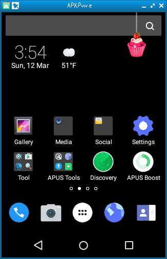

# shashlik
Android Applications on Real Linux

http://www.shashlik.io/ (Original)

# Features
- x86-based
- Support Houdini Binary Translator [http://d.hatena.ne.jp/mjt/20161231/p1]
- Support SD card
- APKpure is pre-installed

# Download
- RPM [https://github.com/yui0/shashlik/releases]

# How to use
- First install and run

```bash
	# rpm -Uvh shashlik-*.x86_64.rpm
	$ /opt/shashlik/bin/shashlik-run com.apkpure.aegon "APKPure"
```

- Run Flappy Bird

```bash
	$ /opt/shashlik/bin/shashlik-install com.dotgears.flappybird.apk
	$ /opt/shashlik/bin/shashlik-run com.dotgears.flappybird FlappyBird
```

# Switching to landscape mode
- ctrl+fn+F11 on Mac
- left-ctrl+F11 on Windows
- ctrl+F11 on Linux

# Where is the APKs?
- APKs [https://apkpure.com/]
- Flappy Bird [http://beste-apps.chip.de/android/app/flappy-bird-apk-android-app,cxo.66885070/]

# Screenshots

  
  

