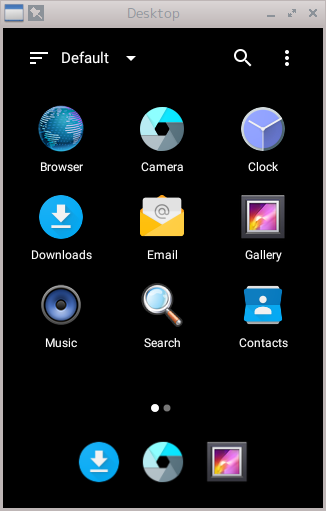

# shashlik


[](https://github.com/yui0/shashlik/releases)

Android Applications on Real Linux

Original: http://www.shashlik.io/

Source: https://github.com/shashlik

The new project is [here](https://github.com/yui0/berry-os)!

# Features
- Android 5.1.1
- x86-based
- Support Houdini Binary Translator [http://d.hatena.ne.jp/mjt/20161231/p1]
- Support SD card
- F-Droid is pre-installed

# Download

- [RPM, Appimage](https://github.com/yui0/shashlik/releases)

# How to build

```bash
$ sh make_shashlik.sh
```

# How to use
- First install and run

```bash
	# rpm -Uvh shashlik-*.x86_64.rpm
	$ /opt/shashlik/bin/shashlik-run com.atomicadd.tinylauncher "Desktop"
	$ /opt/shashlik/bin/shashlik-run com.apkpure.aegon "APKPure"
```

- Run Flappy Bird

```bash
	$ /opt/shashlik/bin/shashlik-install com.dotgears.flappybird.apk
	$ /opt/shashlik/bin/shashlik-run com.dotgears.flappybird FlappyBird
```

## How to uninstall

- sudo rpm -e shashlik*rpm
- rm -rf ~/.local/share/shashlik

# Switching to landscape mode
- ctrl+fn+F11 on Mac
- left-ctrl+F11 on Windows
- ctrl+F11 on Linux

# Where is the APKs?
- APKs [https://apkpure.com/]
- Flappy Bird [http://beste-apps.chip.de/android/app/flappy-bird-apk-android-app,cxo.66885070/]

# Screenshots

  
  
  

# How to check the APP name
- https://www.virustotal.com/
